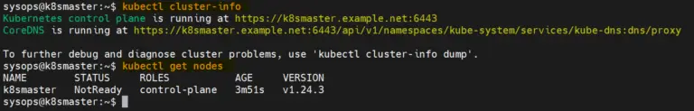
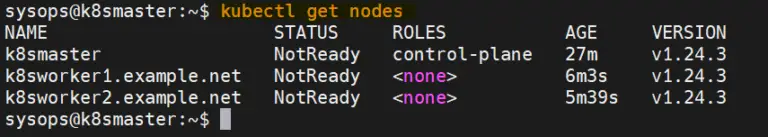
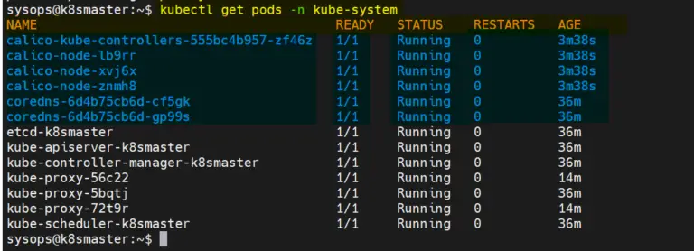
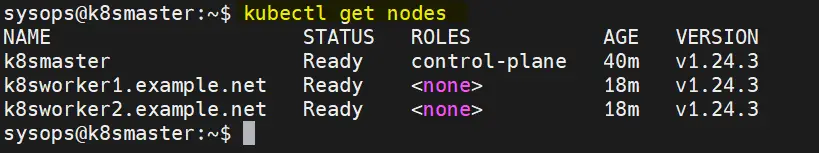

## _Setup K8s (1 master- 1 worker)_

## resource
- Master Node:  192.168.1.173 – k8smaster.example.net
- First Worker Node:  192.168.1.174 – k8sworker1.example.net
- Second Worker Node:  192.168.1.175 – k8sworker2.example.net

## master node
 ```
 sudo hostnamectl set-hostname "k8smaster.example.net"
 exec bash
 ```
## worker node
 sudo hostnamectl set-hostname "k8sworker1.example.net"   // 1st worker node
 sudo hostnamectl set-hostname "k8sworker2.example.net"   // 2nd worker node
 exec bash

## both node

```
sudo vi /etc/hosts 
```

- 192.168.1.173   k8smaster.example.net k8smaster
- 192.168.1.174   k8sworker1.example.net k8sworker1
- 192.168.1.175   k8sworker2.example.net k8sworker2


```
printf "overlay\nbr_netfilter\n" >> /etc/modules-load.d/containerd.conf
modprobe overlay
modprobe br_netfilter
```

```
printf "net.bridge.bridge-nf-call-iptables = 1\nnet.ipv4.ip_forward = 1\nnet.bridge.bridge-nf-call-ip6tables = 1\n" >> /etc/sysctl.d/99-kubernetes-cri.conf
```

```
sudo sysctl --system
```

```
wget https://github.com/containerd/containerd/releases/download/v1.7.13/containerd-1.7.13-linux-amd64.tar.gz -P /tmp/
tar Cxzvf /usr/local /tmp/containerd-1.7.13-linux-amd64.tar.gz
```


```
sudo tee /etc/modules-load.d/containerd.conf <<EOF
overlay
br_netfilter
EOF
```

```
 sudo modprobe overlay
 sudo modprobe br_netfilter
```

```
sudo tee /etc/sysctl.d/kubernetes.conf <<EOF
net.bridge.bridge-nf-call-ip6tables = 1
net.bridge.bridge-nf-call-iptables = 1
net.ipv4.ip_forward = 1
EOF
```

```
sudo install -m 0755 -d /etc/apt/keyrings
curl -fsSL https://download.docker.com/linux/ubuntu/gpg | sudo gpg --dearmor -o /etc/apt/keyrings/docker.gpg
sudo chmod a+r /etc/apt/keyrings/docker.gpg

echo \
  "deb [arch="$(dpkg --print-architecture)" signed-by=/etc/apt/keyrings/docker.gpg] https://download.docker.com/linux/ubuntu \
  "$(. /etc/os-release && echo "$VERSION_CODENAME")" stable" | \
  sudo tee /etc/apt/sources.list.d/docker.list > /dev/null
```
```
 sudo apt update
 sudo apt install -y containerd.io
```

```
 containerd config default | sudo tee /etc/containerd/config.toml >/dev/null 2>&1
 sudo sed -i 's/SystemdCgroup \= false/SystemdCgroup \= true/g' /etc/containerd/config.toml
```

```
 sudo systemctl restart containerd
 sudo systemctl enable containerd
```
```
 curl -s https://packages.cloud.google.com/apt/doc/apt-key.gpg | sudo gpg --dearmour -o /etc/apt/trusted.gpg.d/kubernetes-xenial.gpg
 sudo apt-add-repository "deb http://apt.kubernetes.io/ kubernetes-xenial main"
```
```
 sudo apt update
 sudo apt install -y kubelet kubeadm kubectl
 sudo apt-mark hold kubelet kubeadm kubectl
```
## master
```
sudo kubeadm init --control-plane-endpoint=k8smaster.example.net
```

```
mkdir -p $HOME/.kube
sudo cp -i /etc/kubernetes/admin.conf $HOME/.kube/config
sudo chown $(id -u):$(id -g) $HOME/.kube/config
// tạo lại token thì làm lại 3 bước trên
```
```
sudo kubeadm token create --print-join-command
```
//copy sang worker

//Test Cluster
```
kubectl cluster-info
```

```
kubectl get nodes
```



kubectl get nodes



//Install Calico Network Plugin

```
kubectl apply -f https://raw.githubusercontent.com/projectcalico/calico/v3.26.0/manifests/calico.yaml
```


kubectl get pods -n kube-system



kubectl get nodes



install helm chart
```
curl -L https://git.io/get_helm.sh | bash -s -- --version v3.8.2
```

## uninstall K8s

```
kubectl delete all --all-namespaces --all
```

```
sudo apt-get purge kubeadm kubectl kubelet kubernetes-cni kube*
```

```
sudo apt-get autoremove
```

```
sudo rm -rf ~/.kube
```

```
sudo rm -rf /etc/cni
```
```
sudo rm -rf /etc/kubernetes
```
```
sudo rm -rf /var/lib/etcd
```
```
sudo rm -rf /var/lib/kubelet
```

```
sudo iptables -t filter -F
sudo iptables -t filter -X
sudo systemctl restart docker
```
